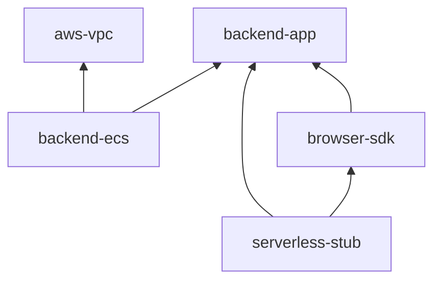
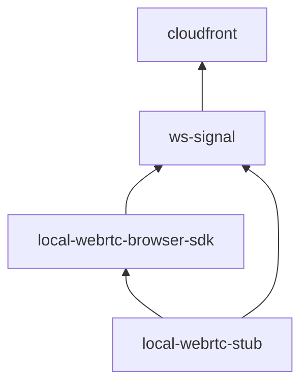
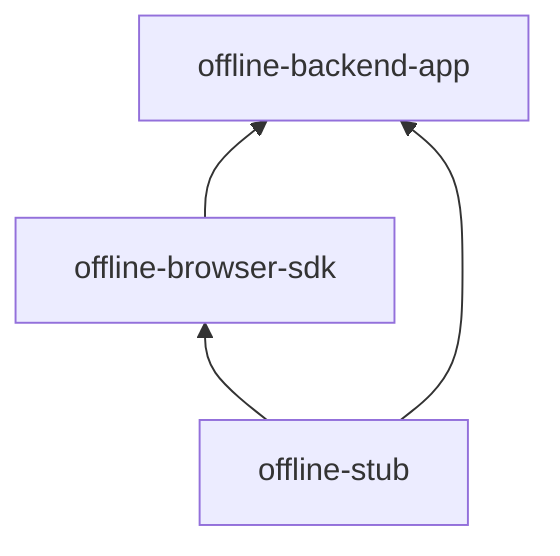

# Gブレイバーバースト ネットワーク

本リポジトリは、Gブレイバーバーストのネットワーク関連モジュールである。
リポジトリは[npm workspace](https://docs.npmjs.com/cli/v7/using-npm/workspaces)、[turborepo](https://turbo.build/repo/docs/handbook)
を用いたモノレポ構造となっている。
とくに断りがない限り、本書のコマンド例のカレントディレクトリは`本リポジトリをcloneした場所の直下`であるとする。

## リポジトリ構成

本リポジトリは、以下の3サービスを提供している。

- 通常バックエンド
  - AWS環境に構築された通常ユーザー用のGブレイバーバーストのバックエンドサービス
  - ユーザー登録、ユーザー認証が必要な機能は本サービスが担当する
- 匿名バックエンド
  - AWS環境に構築された匿名ユーザー用のGブレイバーバーストのバックエンドサービス
  - ユーザー登録なしで利用する機能は、本サービスが担当する
- オフライン対戦
  - イントラネット環境に構築された、オフライン用のGブレイバーバーストのバックエンドサービス

本リポジトリは`packages`ディレクトリに、以下のモジュールが配置されている。

| サービス         | パッケージ名             | 説明                                                                                             |
| ---------------- | ------------------------ | ------------------------------------------------------------------------------------------------ |
| 通常バックエンド | aws-vpc                  | VPCを構築するAWS CDKプロジェクト                                                                 |
| 通常バックエンド | backend-app              | ユーザー登録必須の各種APIを実装したServerless Frameworkプロジェクト                              |
| 通常バックエンド | backend-ecs              | カジュアルマッチを行う常時起動しているFargate環境を構築するAWS CDKプロジェクト                   |
| 通常バックエンド | browser-sdk              | ユーザー登録必須のAPIを呼び出すためのブラウザ向けSDKを実装したnpmパッケージ                      |
| 通常バックエンド | serverless-stub          | ログイン必須APIを呼び出すためのローカルで動作するスタブサーバーを実装したTypeScriptプロジェクト  |
| 匿名バックエンド | cloudfront               | 各種CloudFrontを構築するCloudFormationテンプレート                                               |
| 匿名バックエンド | ws-signal                | シグナルサーバーを構築するServerless Frameworkプロジェクト                                       |
| 匿名バックエンド | local-webrtc-browser-sdk | ログインなしAPIを呼び出すためのブラウザ向けSDKを実装したnpmパッケージ                            |
| 匿名バックエンド | local-webrtc-stub        | ログインなしAPIを呼び出すためのローカルで動作するスタブサーバーを実装したTypeScriptプロジェクト  |
| オフライン対戦   | offline-backend-app      | オフライン対戦サーバーを実装したTypeScriptプロジェクト                                           |
| オフライン対戦   | offline-browser-sdk      | オフライン対戦クライアントを実装したブラウザ向けSDKを実装したnpmパッケージ                       |
| オフライン対戦   | offline-stub             | オフライン対戦サーバーをローカルで動作させるためのスタブサーバーを実装したTypeScriptプロジェクト |

**通常バックエンドの依存関係**

**匿名バックエンドの依存関係**

**オフライン対戦の依存関係**

## 必須ソフト一覧

- aws cli(2.3.4以上)
- node.js(v18.16.0以上)
- npm(9.5.1以上)
- npx(9.5.1以上)
- Docker(20.10.8以上)

## 必須アカウント一覧

- [AWS](https://aws.amazon.com/jp/?nc2=h_lg)
- [Docker Hub](https://hub.docker.com/)
- [serverless dashboard](https://www.serverless.com/dashboard)
- さくらインターネット会員ID

## 本リポジトリが想定する環境

- ローカル環境
  - 作業用端末から直接バックエンドを操作する環境であり、すべての環境のベースとなる
  - Serverless Framework系モジュールはAWS環境にデプロイして動作確認する
  - コンテナはローカル環境で動作確認した後、必要に応じてAWS環境にデプロイする
- 開発環境
  - AWS上に構築された「通常バックエンド」、「匿名バックエンド」の開発環境
  - 原則としてAWS CodeBuildによるCI/CDで環境構築する
  - 原則としてシステム構成は本番環境と同じであるが、開発効率を上げるための仕組み（AWS CDKのホットスワップデプロイ、localhostのリダイレクト許可など）は、開発環境のみ存在する
- 本番環境
  - AWS上に構築された「通常バックエンド」、「匿名バックエンド」の本番環境
  - 原則としてAWS CodeBuildによるCI/CDで環境構築する
- オフライン環境
  - イントラネット上に構築された「オフライン対戦」の本番環境

> [!NOTE]
> AWSのベストプラクティスでは環境ごとに専用アカウントを用意するべきだが、
> 環境構築当時はAWSスキルが低く、単一アカウント内で複数環境を構築してしまった。
> なので、以下項目はそれぞれの環境でユニークになるように設計している。
>
> - AWS Parameter Storeのパラメータ名
> - AWS Secrets Managerのシークレット名
> - Serverless Frameworkのサービス、ステージ名
> - AWS CDK/CloudFormationのスタック名

## セットアップ

本セクションではすべての環境で必要な事前作業を述べる。

1. 開発環境において、[AWS環境セットアップマニュアル](./docs/aws-setup.md)を参考にAWS環境をセットアップする
2. 本番環境において、[AWS環境セットアップマニュアル](./docs/aws-setup.md)を参考にAWS環境をセットアップする
3. [coturnマニュアル（さくらのVPS / Debian）/ セットアップ](./docs/coturn.md)を参考に、coturnサーバーを構築する

## 環境別マニュアル

- [ローカル環境](./docs/local-env.md)
- [オフライン環境](./docs/offline-env.md)
- [開発環境](./docs/dev-env.md)
- [本番環境](./docs/prod-env.md)

## GitHub Actions CI環境構築方法

[GitHub Actions CI環境構築方法](./docs/github-actions-ci.md)を参照。

## パッケージ公開

[npm publishマニュアル](./docs/npm-publish.md)を参照。

## License

MIT
