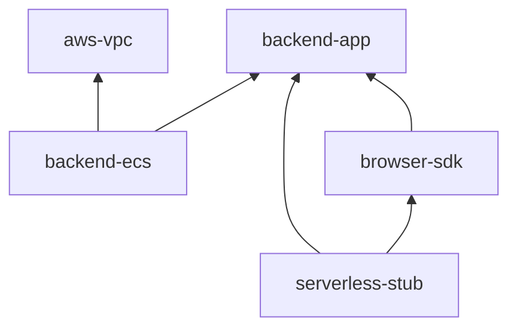
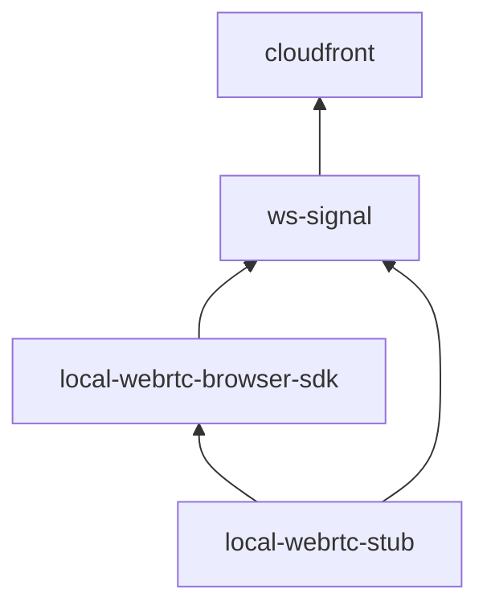
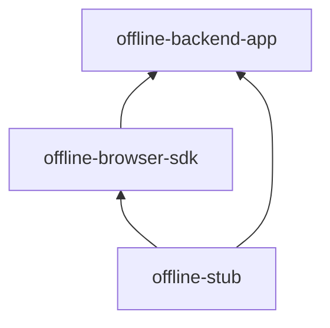

# Gブレイバーバースト ネットワーク

本リポジトリは、Gブレイバーバーストのネットワーク関連モジュールである。
リポジトリは[npm workspace](https://docs.npmjs.com/cli/v7/using-npm/workspaces)、[turborepo](https://turbo.build/repo/docs/handbook)
を用いたモノレポ構造となっている。
とくに断りがない限り、本書のコマンド例のカレントディレクトリは`本リポジトリをcloneした場所の直下`であるとする。

## リポジトリ構成

本リポジトリは、以下の3サービスを提供している。

- ユーザー登録必須API（AWS環境）
- ログインなしAPI（AWS環境）
- オフライン対戦サーバー（イントラネット環境）

本リポジトリは`packages`ディレクトリに、以下のモジュールが配置されている。

| サービス               | パッケージ名             | 説明                                                                                             |
| ---------------------- | ------------------------ | ------------------------------------------------------------------------------------------------ |
| ユーザー登録必須API    | aws-vpc                  | VPCを構築するAWS CDKプロジェクト                                                                 |
| ユーザー登録必須API    | backend-app              | ユーザー登録必須の各種APIを実装したServerless Frameworkプロジェクト                              |
| ユーザー登録必須API    | backend-ecs              | カジュアルマッチを行う常時起動しているFargate環境を構築するAWS CDKプロジェクト                   |
| ユーザー登録必須API    | browser-sdk              | ユーザー登録必須のAPIを呼び出すためのブラウザ向けSDKを実装したnpmパッケージ                      |
| ユーザー登録必須API    | serverless-stub          | ログイン必須APIを呼び出すためのローカルで動作するスタブサーバーを実装したTypeScriptプロジェクト  |
| ログインなしAPI        | cloudfront               | 各種CloudFrontを構築するCloudFormationテンプレート                                               |
| ログインなしAPI        | ws-signal                | シグナルサーバーを構築するServerless Frameworkプロジェクト                                       |
| ログインなしAPI        | local-webrtc-browser-sdk | ログインなしAPIを呼び出すためのブラウザ向けSDKを実装したnpmパッケージ                            |
| ログインなしAPI        | local-webrtc-stub        | ログインなしAPIを呼び出すためのローカルで動作するスタブサーバーを実装したTypeScriptプロジェクト  |
| オフライン対戦サーバー | offline-backend-app      | オフライン対戦サーバーを実装したTypeScriptプロジェクト                                           |
| オフライン対戦サーバー | offline-browser-sdk      | オフライン対戦クライアントを実装したブラウザ向けSDKを実装したnpmパッケージ                       |
| オフライン対戦サーバー | offline-stub             | オフライン対戦サーバーをローカルで動作させるためのスタブサーバーを実装したTypeScriptプロジェクト |

**ユーザー登録必須APIの依存関係**



**ログインなしAPIの依存関係**



**オフライン対戦サーバーの依存関係**



## 必須ソフト一覧

- aws cli(2.3.4以上)
- node.js(v18.16.0以上)
- npm(9.5.1以上)
- npx(9.5.1以上)
- Docker(20.10.8以上)

## 必須アカウント一覧

- [AWS](https://aws.amazon.com/jp/?nc2=h_lg)
- [Docker Hub](https://hub.docker.com/)
- [serverless dashboard](https://www.serverless.com/dashboard)

## 本リポジトリが想定する環境

- ローカル環境
  - 開発用端末で開発用サーバーを起動して、`localhost`からアクセスする環境
  - 原則としてサーバー機能は開発環境に接続する
  - Docker Imageなどローカルでも十分に動作するものは、ローカル環境で動作させることもある
- 開発環境
  - AWS上に構築された開発環境
  - 原則としてシステム環境は本番環境と同じである
  - 開発効率を上げるための仕組み（AWS CDKのホットスワップデプロイ、localhostのリダイレクト許可など）は、開発環境のみ存在する
- 本番環境
  - AWS上に構築された本番環境

## セットアップ

本セクションではすべての環境で必要な事前作業を述べる。

1. 開発環境において、[AWS環境セットアップマニュアル](./docs/aws-setup.md)を参考にAWS環境をセットアップする
2. 本番環境において、[AWS環境セットアップマニュアル](./docs/aws-setup.md)を参考にAWS環境をセットアップする
3. [coturnマニュアル（さくらのVPS / Debian）/ セットアップ](./docs/coturn.md)を参考に、coturnサーバーを構築する

## 環境別マニュアル

- [ローカル環境](./docs/local-env.md)
- [開発環境](./docs/dev-env.md)
- [本番環境](./docs/prod-env.md)

## GitHub Actions CI環境構築方法

[GitHub Actions CI環境構築方法](./docs/github-actions-ci.md)を参照。

## パッケージ公開

**通常**

```shell
# 画面の指示に従い、変更内容を記入する
npx changeset
npx changeset version
npm install

npm run build
npx changeset publish
```

**β版**

```shell
# β版モード開始
npx changeset pre enter beta

# 画面の指示に従い、変更内容を記入する
npx changeset
npx changeset version
npm install

npm run build
npx changeset publish

# β版モード終了
npx changeset pre exit
```

## License

MIT
