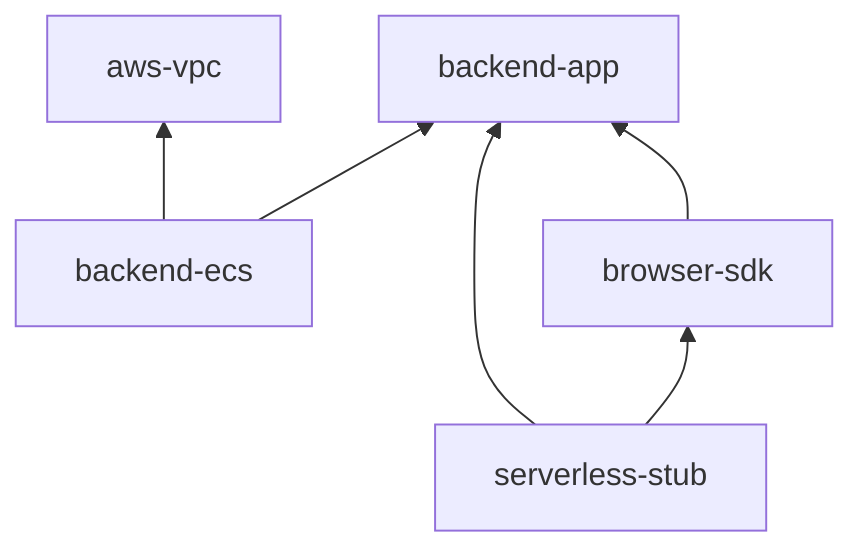
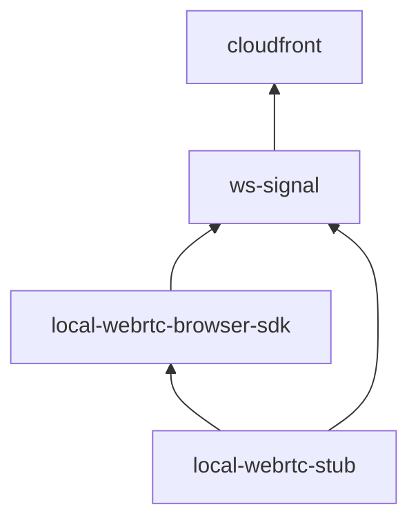
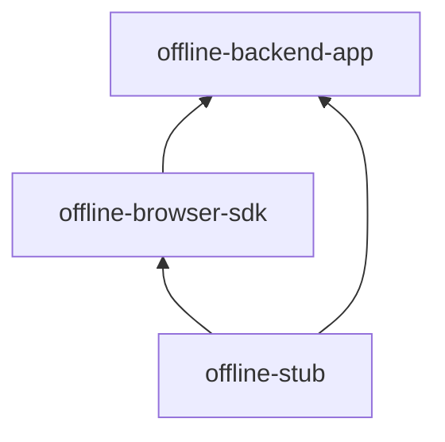

# Gブレイバーバースト ネットワーク

本リポジトリは、Gブレイバーバーストのネットワーク関連モジュールである。
リポジトリは[npm workspace](https://docs.npmjs.com/cli/v7/using-npm/workspaces)、[turborepo](https://turbo.build/repo/docs/handbook)
を用いたモノレポ構造となっている。
とくに断りがない限り、本書のコマンド例のカレントディレクトリは`本リポジトリをcloneした場所の直下`であるとする。

## リポジトリ構成

本リポジトリは、以下の3サービスを提供している。

- ユーザー登録必須API（AWS環境）
- ログインなしAPI（AWS環境）
- オフライン対戦サーバー（イントラネット環境）

本リポジトリは`packages`ディレクトリに、以下のモジュールが配置されている。

| サービス               | パッケージ名             | 説明                                                                                             |
| ---------------------- | ------------------------ | ------------------------------------------------------------------------------------------------ |
| ユーザー登録必須API    | aws-vpc                  | VPCを構築するAWS CDKプロジェクト                                                                 |
| ユーザー登録必須API    | backend-app              | ユーザー登録必須の各種APIを実装したServerless Frameworkプロジェクト                              |
| ユーザー登録必須API    | backend-ecs              | カジュアルマッチを行う常時起動しているFargate環境を構築するAWS CDKプロジェクト                   |
| ユーザー登録必須API    | browser-sdk              | ユーザー登録必須のAPIを呼び出すためのブラウザ向けSDKを実装したnpmパッケージ                      |
| ユーザー登録必須API    | serverless-stub          | ログイン必須APIを呼び出すためのローカルで動作するスタブサーバーを実装したTypeScriptプロジェクト  |
| ログインなしAPI        | cloudfront               | 各種CloudFrontを構築するCloudFormationテンプレート                                               |
| ログインなしAPI        | ws-signal                | シグナルサーバーを構築するServerless Frameworkプロジェクト                                       |
| ログインなしAPI        | local-webrtc-browser-sdk | ログインなしAPIを呼び出すためのブラウザ向けSDKを実装したnpmパッケージ                            |
| ログインなしAPI        | local-webrtc-stub        | ログインなしAPIを呼び出すためのローカルで動作するスタブサーバーを実装したTypeScriptプロジェクト  |
| オフライン対戦サーバー | offline-backend-app      | オフライン対戦サーバーを実装したTypeScriptプロジェクト                                           |
| オフライン対戦サーバー | offline-browser-sdk      | オフライン対戦クライアントを実装したブラウザ向けSDKを実装したnpmパッケージ                       |
| オフライン対戦サーバー | offline-stub             | オフライン対戦サーバーをローカルで動作させるためのスタブサーバーを実装したTypeScriptプロジェクト |

**ユーザー登録必須APIの依存関係**



**ログインなしAPIの依存関係**



**オフライン対戦サーバーの依存関係**



## 必須ソフト一覧

- aws cli(2.3.4以上)
- node.js(v18.16.0以上)
- npm(9.5.1以上)
- npx(9.5.1以上)
- Docker(20.10.8以上)

## 必須アカウント一覧

- [AWS](https://aws.amazon.com/jp/?nc2=h_lg)
- [Docker Hub](https://hub.docker.com/)
- [serverless dashboard](https://www.serverless.com/dashboard)

## セットアップ

本セクションではすべての環境で必要な事前作業を述べる。

### 1. VPC作成

[ここ](./packages/aws-vpc/README.md#deploy-command)を参考に、VPCを作成する。

### 2. マッチメイク用ECRリポジトリ作成

AWSでマッチメイク用ECRリポジトリを作成する。

### 3. Docker Hubアクセストークン発行

[ここ](https://docs.docker.com/docker-hub/access-tokens/)を参考に、Docker Hubのアクセストークンを発行する。

### 4. API GatewayがCloud Watch Logsに書き込むためのIAM Roleを作成

以下を参考に、API GatewayがCloud Watch Logsに書き込むためのIAM Roleを作成する。
Role名は「serverlessApiGatewayCloudWatchRole」とすること。

https://dev.classmethod.jp/articles/tsnote-apigw-what-to-do-when-cloudwatch-logs-role-arn-must-be-set-in-account-settings-to-enable-logging-occurs-with-api-gateway/

### 5. Cognitoユーザープールの作成

Cognitoのユーザープールを以下条件で作成する。

- CognitoユーザープールのサインインオプションはEメールに設定する **(後から変更できない)**
- Hosted UIを有効にする
  - スコープにopenid, email, profile、phone、aws.cognito.signin.user.adminを追加する
- 許可されているコールバック URL、許可されているサインアウト URLに`http://localhost:8080`、GブレイバーバーストをホストしているURLを設定する
- 検証メッセージの検証タイプを`Link`に設定する

### 6. CognitoにGooogleのソーシャルログインを追加

Google Play ConsoleでOAuth2.0クライアントIDを以下条件で追加する。
この時に生成されるクライアントIDとクライアントシークレットを控えておく。

- 承認済みのリダイレクト URIに`https://<Cognitoのドメイン>/oauth2/idpresponse`を追加する

CognitoのアイデンティティプロバイダーにGoogleを以下条件で追加する。

- 許可されたスコープは`profile email openid`を指定
- 属性マッピングは以下のように設定

| Cognito属性        | Google属性 |
| ------------------ | ---------- |
| email              | email      |
| picture            | picture    |
| preferred_username | name       |

CgonitoのホストされたUIのID プロバイダーにGoogleを追加する。

### 7. 各種ドメイン名の準備

#### 7.1. APIサーバー用のドメイン名およびACM証明書の準備

APIサーバー用のドメイン名をRoute53で準備し、ACMでSSL証明書を発行する。
ACM証明書はAPIサーバー用のドメイン名のワイルドカード証明書である必要がある。

例

- APIサーバー用のドメイン名: ws-api.example.com
- ACM証明書: \*.ws-api.example.com

#### 7.2. シグナルサーバー用のドメイン名およびACM証明書の準備

シグナルサーバー用のドメイン名をRoute53で準備し、ACMでSSL証明書を発行する。
ACM証明書はシグナルサーバー用のドメイン名のワイルドカード証明書である必要がある。

例

- シグナルサーバー用のドメイン名: ws-signal.example.com
- ACM証明書: \*.ws-signal.example.com

#### 7.3. バックエンドCloudFront用のドメイン名およびACM証明書の準備

バックエンドCloudFront用のドメイン名をRoute53で準備し、ACMでSSL証明書を発行する。
ACM証明書はバックエンドCloudFront用のドメイン名のワイルドカード証明書である必要がある。

例

- バックエンドCloudFront用のドメイン名: backend.example.com
- ACM証明書: \*.backend.example.com

### 8. coturnサーバーの構築

以下手順書にしたがってcoturnサーバーを構築する。  
[coturnマニュアル（さくらのVPS / Debian）/ セットアップ](./docs/coturn.md)

## 各環境について

- [ローカル環境](./docs/local-env.md)
- [開発環境](./docs/dev-env.md)
- [本番環境](./docs/prod-env.md)

## GitHub Actions CI環境構築方法

### 事前作業

- serverless dashboardにサインインし、[このページ](https://app.serverless.com/settings/accessKeys)からasccesskeyを生成する
- AWSで「SlsCli用IAMポリシー」をアタッチしたIAMユーザーを作成し、アクセスキーIDとシークレットキーを控えておく

**SlsCli用IAMポリシー**

```json
{
  "Version": "2012-10-17",
  "Statement": [
    {
      "Sid": "VisualEditor0",
      "Effect": "Allow",
      "Action": [
        "s3:*",
        "cloudformation:DescribeStackResource",
        "ssm:GetParameter"
      ],
      "Resource": "*"
    }
  ]
}
```

### Secrets設定

[ここ](https://docs.github.com/ja/actions/security-guides/using-secrets-in-github-actions)を参考にGitHub
ActionsのSecretsを設定する。
以下が設定内容である。

| シークレット名        | 値                                        |
| --------------------- | ----------------------------------------- |
| SERVERLESS_ACCESS_KEY | serverless dashboardから発行したaccesskey |
| AWS_ACCESS_KEY_ID     | AWS IMAユーザー アクセスキーID            |
| AWS_SECRET_ACCESS_KEY | AWS IMAユーザー シークレットキー          |

## パッケージ公開

**通常**

```shell
# 画面の指示に従い、変更内容を記入する
npx changeset
npx changeset version
npm install

npm run build
npx changeset publish
```

**β版**

```shell
# β版モード開始
npx changeset pre enter beta

# 画面の指示に従い、変更内容を記入する
npx changeset
npx changeset version
npm install

npm run build
npx changeset publish

# β版モード終了
npx changeset pre exit
```

## License

MIT
